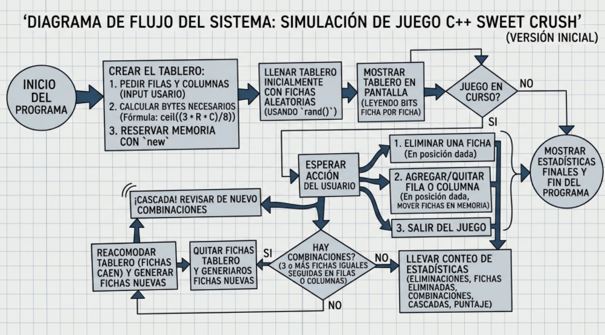
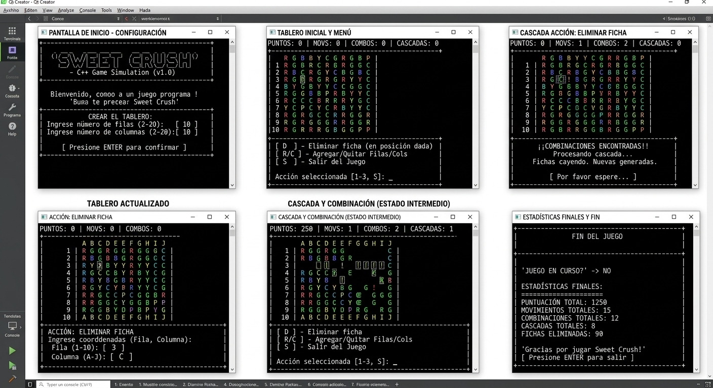

---
output:
  pdf_document: default
  html_document: default
---
# Informe Preliminar – Desafío I  

**Curso:** Informática II – Semestre 2026-2  
**Entrega:** Análisis y diseño preliminar (11 de septiembre)  

---

## 1. Contextualización del problema

El desafío pide construir una versión del juego **Sweet Crush**, que es parecido a los juegos de combinar fichas iguales (tipo "match 3" , Candy Crush) que se juegan en el celular. La idea general, vista desde el jugador, es esta:

- Hay un tablero rectangular formado por filas y columnas, y cada casilla tiene una "ficha" de un tipo determinado (en total hay 6 tipos distintos de fichas).
- El jugador elige una posición del tablero y elimina la ficha que está ahí.
- Si al quitar esa ficha quedan 3 o más fichas iguales seguidas en una fila o en una columna, esas fichas también se eliminan.
- Después de eliminar fichas, las que quedan "caen" para llenar los espacios vacíos y se generan fichas nuevas arriba. Esto puede provocar que se formen combinaciones nuevas sin que el jugador haga nada, lo que se llama una **cascada**.
- El tablero también se puede modificar mientras se juega: se pueden agregar o quitar filas y columnas, incluso en posiciones intermedias (no solo al final del tablero).

## 2. Análisis preliminar

### 2.1 Datos de entrada

Pensando en lo que el programa va a tener que leer del usuario (por teclado, con `cin`), se identifican al menos estos datos de entrada:

- Número de filas y número de columnas iniciales del tablero (para crearlo la primera vez).
- La opción del menú que el usuario quiere ejecutar (un número entero).
- La posición (fila y columna) de la ficha que el usuario quiere eliminar.
- En las operaciones de modificar la estructura del tablero: en qué fila o columna se quiere insertar o eliminar (ya que puede ser una posición intermedia, no solo el borde).

Todavía no está totalmente decidido si se va a validar que el usuario no ingrese un tablero extremadamente grande (por ejemplo 10000x10000). Posiblemente se agregue algún límite razonable más adelante..

### 2.2 Datos de salida

- El tablero mostrado en pantalla, de una forma que se entienda (probablemente usando un caracter o letra distinta por cada tipo de ficha, en vez de mostrar directamente el número binario, aunque el enunciado también pide poder ver el formato binario).
- Mensajes indicando si se formó una combinación, cuántas fichas se eliminaron, si hubo cascada, etc.
- Al final o cuando el usuario lo pida, un resumen del estado de la partida: dimensiones actuales, cantidad de eliminaciones hechas por el usuario, fichas eliminadas en total, combinaciones detectadas, cascadas de la última jugada y puntaje.

### 2.3 Procesos que debe realizar el programa

En esta primera revisión se identifican estos procesos:

1. Crear el tablero: pedir filas y columnas, calcular cuántos bytes se necesitan (como cada ficha ocupa 3 bits, se necesitan `(3 * filas * columnas)` bits en total, y eso hay que redondearlo hacia arriba para saber cuántos bytes reservar) y reservar esa memoria con `new`.
2. Llenar el tablero al inicio con fichas generadas de forma aleatoria (esto todavía no se ha analizado a fondo, posiblemente se use `rand()`).
3. Mostrar el tablero en pantalla, leyendo ficha por ficha desde la representación en bits.
4. Eliminar una ficha en la posición que indique el usuario.
5. Revisar si hay combinaciones (3 o más fichas iguales seguidas) en filas y en columnas.
6. Quitar las fichas que forman parte de una combinación.
7. Reacomodar el tablero (que las fichas de arriba "caigan" a las posiciones vacías) y NO se deben generar fichas nuevas en el tablero.
8. Repetir la revisión de combinaciones mientras se sigan formando nuevas (esto es la cascada), llevando la cuenta de cuántas cascadas van ocurriendo.
9. Agregar o quitar una fila o una columna en una posición dada por el usuario, incluyendo mover en memoria las fichas que correspondan.
10. Llevar el conteo de estadísticas de la partida (eliminaciones, fichas eliminadas, combinaciones, cascadas, puntaje).

### 2.4 Variables que posiblemente serán necesarias

Se piensan en algunas variables (de forma preliminar) como:

- `int filas`, `int columnas`: dimensiones actuales del tablero.
- `unsigned char *tablero`: puntero a la memoria dinámica donde se guardan los bits de todas las fichas. Se eligió `unsigned char` porque el documento lo sugiere directamente y porque es el tipo más natural para trabajar byte por byte con operadores bitwise.
- Variables para llevar el conteo: `int eliminacionesUsuario`, `int fichasEliminadasTotal`, `int combinacionesDetectadas`, `int cascadasActuales`, `int puntaje`. Se pusieron como `int` porque en principio no se esperan valores tan grandes como para necesitar otro tipo, aunque esto se debe revisar si el juego permite partidas muy largas.
- Variables temporales dentro de las funciones, como la posición fila/columna que el usuario ingresa, o contadores usados en los ciclos `for` que recorren el tablero.

### 2.5 Decisiones que debe tomar el programa

- Definir, para cada posición del tablero, en qué byte(s) están sus 3 bits y en qué posición dentro de ese byte (o de esos dos bytes, si la ficha queda repartida entre dos bytes consecutivos).
- Evaluar si al eliminar una ficha se marca con un código especial (por ejemplo `111`, ya que sobran 2 combinaciones de las 8 posibles) o si se hace de otra forma.  
- Decidir cuándo una eliminación de fila o columna realmente debe achicar la memoria reservada (**se indica que solo se debe hacer cuando el uso cae por debajo del 65%**).
- Criterio de puntaje (esto es libre de elegirse). Inicialmente se considera algo simple, como sumar puntos por cada ficha eliminada y un extra por cada cascada.

### 2.6 Validaciones que podrían ser necesarias

- Que la fila y columna que el usuario ingrese para eliminar una ficha estén dentro del tablero.
- Que no se intente eliminar una fila o columna si el tablero se queda con dimensiones inválidas (por ejemplo, no debería poder quedar con 0 filas). Si se presenta el caso en el que el tablero queda con 0 filas, mostrar mensaje al usuario.  
- Que la cantidad de filas y columnas iniciales no sea negativa o cero.
- Posiblemente validar que el usuario no ingrese letras donde se espera un número.  

## 3. Diseño preliminar de la solución

### 3.1 Estructura general del programa

En esta primera propuesta, el programa se organiza alrededor de un **menú principal** que se repite hasta que el usuario decide salir. Cada opción del menú corresponde, en principio, a una función distinta. Se exige separar el programa en varios archivos `.h` y `.cpp`, por lo tanto la idea es dividir más o menos así los archivos:

- Un archivo con las funciones relacionadas al menú y al flujo principal.
- Un archivo con las funciones de creación y manejo de memoria del tablero.
- Un archivo con las funciones que leen y escriben una ficha usando bits.
- Un archivo con las funciones que buscan combinaciones y hacen la reorganización/cascada.
- Un archivo con las funciones para agregar/eliminar filas y columnas.

### 3.2 Funcionamiento del menú

El menú se pensó, en esta etapa, con las siguientes opciones:

1. Crear un tablero nuevo (pide filas y columnas).
2. Mostrar el tablero actual.
3. Eliminar una ficha en una posición indicada por el usuario.
4. Agregar una fila.
5. Eliminar una fila.
6. Agregar una columna.
7. Eliminar una columna.
8. Ver estadísticas de la partida (puntaje, eliminaciones, cascadas, etc.).
9. Salir del programa.

Se puede usar `switch` para el menú porque es una situación típica de "elegir entre varias opciones numeradas" para facilitar la elección del usuario.

### 3.3 Flujo general de ejecución

De forma general se ppiensa en un flujo así:

1. Se muestra el menú.
2. El usuario ingresa un número de opción.
3. Se entra al `switch` y se ejecuta la función correspondiente a esa opción.
4. Cuando la función termina, se vuelve a mostrar el menú (excepto si la opción fue "Salir").
5. Esto se repite dentro de un ciclo `do-while`, controlado por una variable booleana o por comparar si la opción fue la de salir.

## 4. Diagrama de flujo preliminar

## 5. Pendientes y decisiones que se deben revisar más adelante

Para ser honestos con el estado real del análisis, estas son cosas que todavía no están cerradas:

- La forma exacta de calcular el byte y el desplazamiento de bits para una posición dada del tablero (fila, columna) → posición en la secuencia de bits.
- Cómo se va a generar exactamente el número aleatorio de la ficha (con qué función y si se necesita algo especial para que sea una distribución uniforme entre los 6 tipos).
- El criterio final de puntaje.
- La forma concreta de mover los bits al insertar o eliminar una fila/columna intermedia (esto seguramente va a ser lo más complicado de todo el proyecto).
- La regla exacta de cuándo redimensionar la memoria al eliminar (el 65% mencionado en el documento).

## Mockups de apoyo

